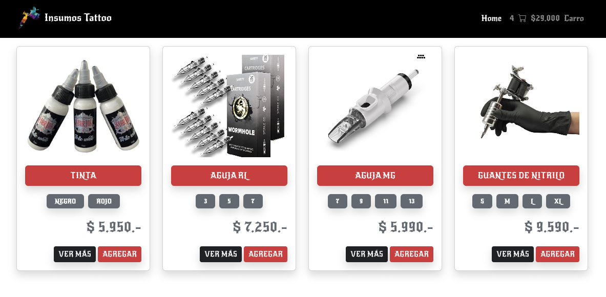

# Plantilla ecommerce con React

## Descripción

Maquetación de un ecommerce con React, utilizando react-router y bootstrap para los estilos.

Se utilizo para ejemplificar **Context**, compariendo funciones, estados y datos entre componentes, evidenciando lo simple y util que es encapsular datos y funciones en un contexto y desde ahi proveerlas a diversos modulos.

Además se uso **Navite Router** y **UseParams** para leer los parametros de la url y mostrar el detalle de un producto.

## Instalación y lanzamiento

```
npm install
npm run start
```


